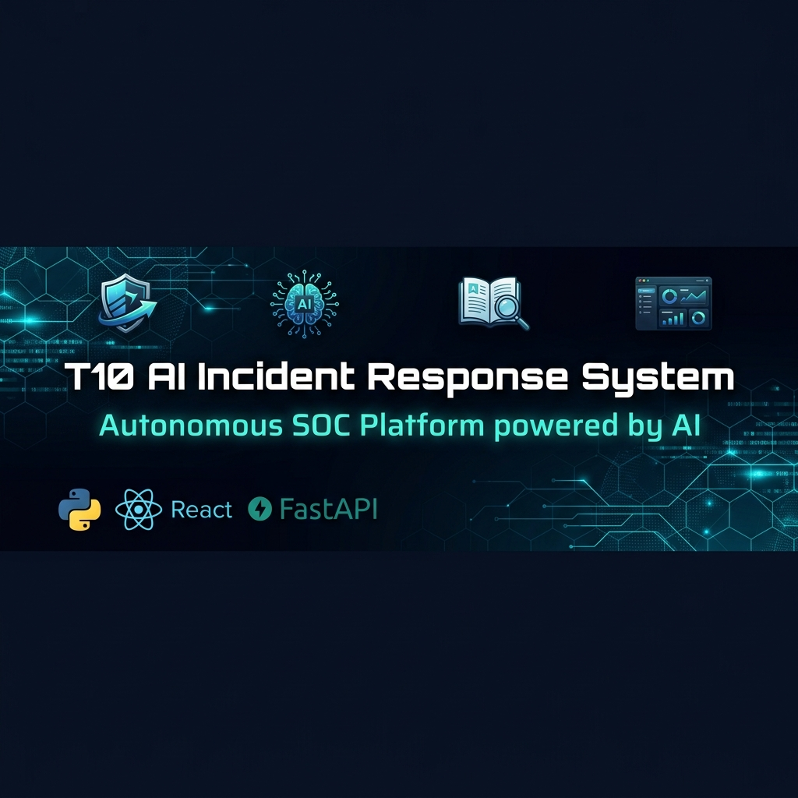
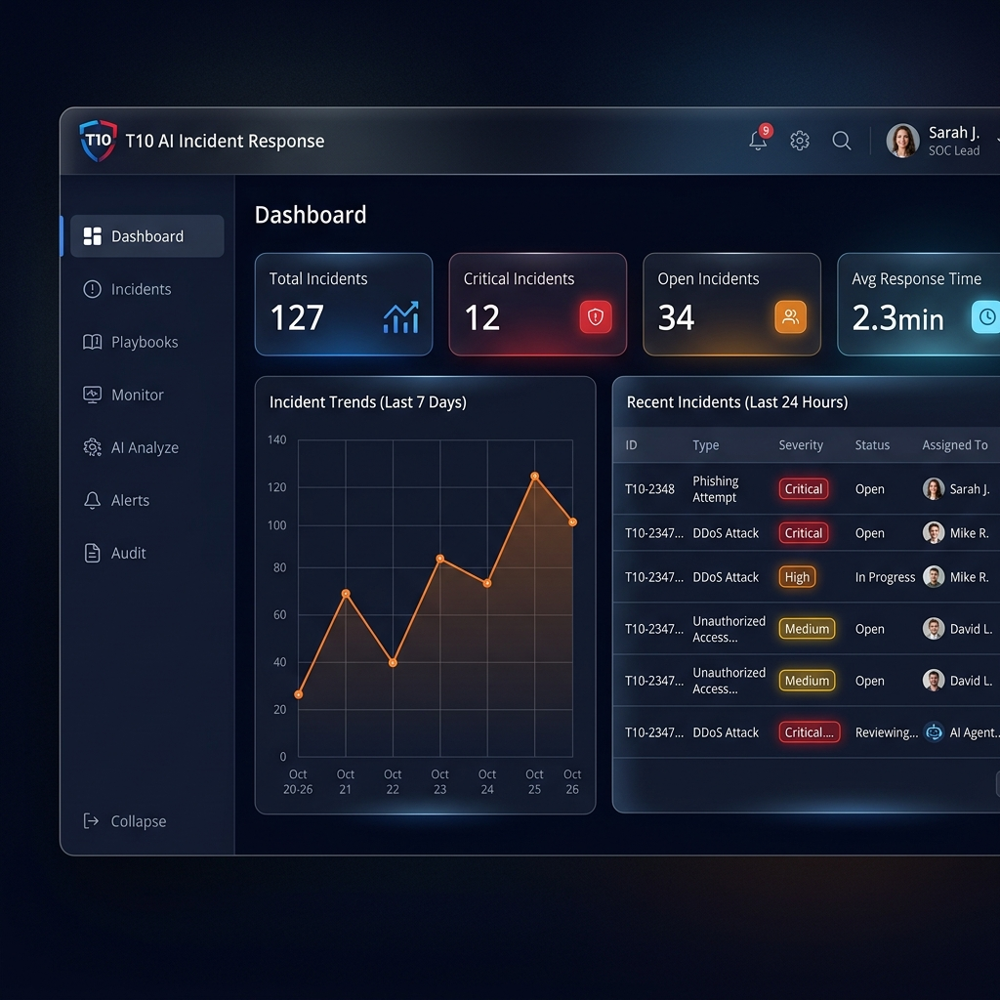
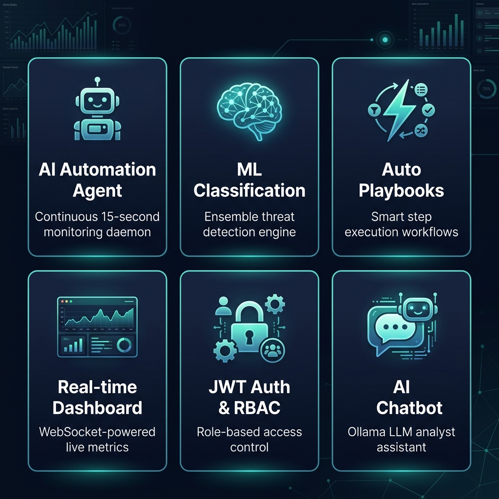
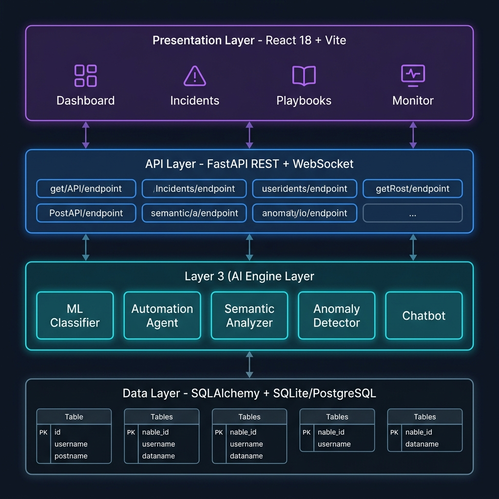

<div align="center">



# 🛡️ T10 — AI Incident Response & Automated Playbook System

**An enterprise-grade, autonomous Security Operations Center (SOC) platform powered by AI**

[](https://python.org)
[](https://fastapi.tiangolo.com)
[](https://reactjs.org)
[](https://vitejs.dev)
[](https://scikit-learn.org)
[](LICENSE)
[]()
[]()

[🚀 Quick Start](#-quick-start) • [📡 API Docs](#-api-reference) • [🏗️ Architecture](#️-system-architecture) • [👥 Team](#-team) • [📄 License](#-license)

</div>

---

## 📸 Preview



> *Real-time SOC Dashboard — Live incident tracking, AI threat analysis, and playbook execution*

---

## 📌 Table of Contents

- [Overview](#-overview)
- [Key Features](#-key-features)  
- [System Architecture](#️-system-architecture)
- [Tech Stack](#️-tech-stack)
- [Project Structure](#-project-structure)
- [Quick Start](#-quick-start)
- [API Reference](#-api-reference)
- [AI Modules](#-ai-modules)
- [Default Credentials](#-default-credentials)
- [Security](#-security--production-readiness)
- [Team](#-team)
- [License](#-license)

---

## 🔍 Overview

The **T10 AI Incident Response & Automated Playbook System** is a production-ready autonomous security platform built for modern SOC teams. It eliminates manual alert triage by automatically classifying threats, scoring severity, assigning incidents, and executing response playbooks — all within **15 seconds** of alert ingestion.

> **Team:** T10 &nbsp;|&nbsp; **Institution:** HH8 &nbsp;|&nbsp; **Version:** 3.0.0 &nbsp;|&nbsp; **Released:** April 2026

### 🎯 Problem Statement
Modern SOC teams are overwhelmed by high-volume alerts, slow manual triage, and inconsistent response processes — leading to missed threats and analyst burnout.

### ✅ Solution
A fully autonomous AI platform that classifies, scores, assigns, and responds to security incidents — reducing manual work by **70%+** and response time to **< 15 seconds**.

---

## ✨ Key Features



| # | Feature | Description |
|---|---------|-------------|
| 🤖 | **AI Automation Agent** | Continuous 15-second monitoring daemon — no human needed |
| 🧠 | **ML Classification Engine** | Ensemble classifier + NLP semantic analysis |
| ⚡ | **Automated Playbooks** | Smart step-by-step response workflows |
| 📊 | **Real-time Dashboard** | WebSocket-powered live SOC metrics & charts |
| 🔐 | **JWT Auth + RBAC** | Role-based access: Admin / Analyst / Viewer |
| 🔍 | **Anomaly Detection** | PyOD-based detection for unknown threat patterns |
| 💬 | **AI Chatbot** | Ollama local LLM for analyst assistance |
| 📋 | **Incident Lifecycle** | Full management from alert → resolution |
| 📈 | **Escalation Prediction** | Risk-scored escalation likelihood per incident |
| 🗂️ | **Audit Trail** | Complete immutable log of every system action |

---

## 🏗️ System Architecture



```
┌────────────────────────────────────────────────┐
│         PRESENTATION LAYER (React + Vite)       │
│  Dashboard │ Incidents │ Playbooks │ Monitor     │
└───────────────────────┬────────────────────────┘
                        │  REST + WebSocket
┌───────────────────────▼────────────────────────┐
│            API LAYER (FastAPI :8000)            │
│  Auth │ Alerts │ Incidents │ Playbooks │ Monitor │
└───────────────────────┬────────────────────────┘
                        │
┌───────────────────────▼────────────────────────┐
│               AI ENGINE LAYER                   │
│  ML Engine │ Automation Agent │ Semantic Analyzer│
│  Anomaly Detector │ Chatbot │ Explainability     │
└───────────────────────┬────────────────────────┘
                        │ SQLAlchemy ORM
┌───────────────────────▼────────────────────────┐
│         DATA LAYER (SQLite / PostgreSQL)         │
│  Users │ Alerts │ Incidents │ Playbooks │ Audit  │
└────────────────────────────────────────────────┘
```

### Autonomous Response Flow
```
Alert In → AI Classify → Severity Score → Auto-Assign → Playbook Execute → Dashboard Update
  < 1s         < 1s           < 1s           < 1s           < 15s               Real-time
```

---

## 🛠️ Tech Stack

### Backend
| Technology | Version | Purpose |
|---|---|---|
| Python | 3.10+ | Core language |
| FastAPI | 0.109.0 | REST API framework |
| SQLAlchemy | 2.0.25 | ORM & database |
| Pydantic | 2.5.3 | Data validation |
| scikit-learn | 1.4.0 | ML classification |
| PyOD | 1.1.5 | Anomaly detection |
| spaCy | 3.7.2 | NLP / semantic analysis |
| Transformers | 4.36.2 | Deep learning models |
| PyTorch | 2.1.2 | Neural network backend |
| Ollama | 0.1.32 | Local LLM chatbot |
| python-jose | 3.3.0 | JWT authentication |
| passlib[bcrypt] | 1.7.4 | Password hashing |
| psutil | 5.10.0 | System monitoring |
| uvicorn | 0.27.0 | ASGI server |

### Frontend
| Technology | Version | Purpose |
|---|---|---|
| React | 18+ | UI framework |
| Vite | 5+ | Build tool |
| React Router | 6+ | Client-side routing |
| WebSocket API | Native | Real-time feeds |
| React Context | Built-in | State management |

---

## 📁 Project Structure

```
hh8-major-project-1/
├── 📁 backend/
│   ├── main.py                       # FastAPI app entry point
│   ├── requirements.txt              # Python dependencies
│   └── app/
│       ├── ai_engine.py              # Rule-based AI classifier
│       ├── ml_engine.py              # ML ensemble engine
│       ├── ensemble_classifier.py    # Threat classification
│       ├── semantic_analyzer.py      # NLP analysis
│       ├── anomaly_detector.py       # PyOD anomaly detection
│       ├── automation_agent.py       # ⭐ Autonomous daemon
│       ├── chatbot.py                # Ollama LLM chatbot
│       ├── confidence_scorer.py      # AI confidence scoring
│       ├── explainability.py         # AI decision explainability
│       ├── system_monitor.py         # Resource monitoring
│       ├── models.py                 # DB models
│       ├── schemas.py                # Pydantic schemas
│       └── routers/
│           ├── auth.py               # Authentication
│           ├── incidents.py          # Incident management
│           ├── playbooks.py          # Playbook execution
│           ├── dashboard.py          # Dashboard metrics
│           ├── automation.py         # Agent control
│           ├── monitor.py            # WebSocket monitor
│           └── chatbot.py            # Chatbot endpoint
│
├── 📁 frontend/
│   └── src/
│       ├── pages/
│       │   ├── DashboardPage.jsx     # Main SOC dashboard
│       │   ├── IncidentsPage.jsx     # Incident management
│       │   ├── PlaybooksPage.jsx     # Playbook manager
│       │   ├── AIAnalyzePage.jsx     # AI analysis center
│       │   ├── MonitorPage.jsx       # Live monitoring
│       │   ├── AlertsPage.jsx        # Alert management
│       │   └── AuditPage.jsx         # Audit trail
│       └── components/
│           ├── Sidebar.jsx
│           ├── Topbar.jsx
│           └── Chatbot.vue
│
├── 📁 docs/images/                   # Project screenshots & diagrams
├── demo_test.py                      # End-to-end tests
├── start_services.bat                # ▶ Windows startup
├── start_services.sh                 # ▶ Linux/Mac startup
├── SETUP_OLLAMA.bat                  # Chatbot setup
├── LICENSE                           # MIT License
└── README.md                         # This file
```

---

## 🚀 Quick Start

### Prerequisites

```
Python 3.10+    Node.js 18+    npm 9+    Git
```

### ⚡ One-Click Start (Recommended)

**Windows:**
```bat
start_services.bat
```
**Linux / macOS:**
```bash
bash start_services.sh
```

### 🔧 Manual Setup

**1. Clone**
```bash
git clone https://github.com/divyar2674/hh8-major-project-1.git
cd hh8-major-project-1
```

**2. Backend**
```bash
cd backend
python -m venv venv
venv\Scripts\activate          # Windows
# source venv/bin/activate     # Linux/Mac
pip install -r requirements.txt
uvicorn main:app --reload --host 0.0.0.0 --port 8000
```

**3. Frontend**
```bash
cd frontend
npm install
npm run dev
```

**4. (Optional) AI Chatbot**
```bash
SETUP_OLLAMA.bat               # Windows
```

### 🌐 Service URLs

| Service | URL | Auth |
|---|---|---|
| 🖥️ Web Dashboard | http://localhost:5173 | ✅ Required |
| 📡 REST API | http://localhost:8000 | ✅ Required |
| 📚 Swagger Docs | http://localhost:8000/api/docs | ❌ Open |
| ❤️ Health Check | http://localhost:8000/api/health | ❌ Open |
| 🔌 WebSocket | ws://localhost:8000/api/monitor/ws | ✅ Required |

---

## 📡 API Reference

> Full interactive docs: **http://localhost:8000/api/docs**

<details>
<summary><b>🔐 Authentication</b></summary>

| Method | Endpoint | Description |
|---|---|---|
| `POST` | `/api/auth/login` | Login & get JWT token |
| `GET` | `/api/auth/me` | Get current user info |
| `POST` | `/api/auth/logout` | Invalidate session |

</details>

<details>
<summary><b>🚨 Alerts</b></summary>

| Method | Endpoint | Description |
|---|---|---|
| `POST` | `/api/alerts` | Ingest new security alert |
| `GET` | `/api/alerts` | List all alerts |
| `GET` | `/api/alerts/{id}` | Get alert detail |

</details>

<details>
<summary><b>📋 Incidents</b></summary>

| Method | Endpoint | Description |
|---|---|---|
| `POST` | `/api/incidents` | Create incident |
| `GET` | `/api/incidents` | List incidents |
| `GET` | `/api/incidents/{id}` | Get incident |
| `PATCH` | `/api/incidents/{id}` | Update status |

</details>

<details>
<summary><b>📖 Playbooks</b></summary>

| Method | Endpoint | Description |
|---|---|---|
| `GET` | `/api/playbooks/` | List playbooks |
| `POST` | `/api/playbooks/` | Create playbook |
| `POST` | `/api/playbooks/{id}/execute/{incident_id}` | Execute |
| `PATCH` | `/api/playbooks/executions/{id}/step` | Update step |

</details>

<details>
<summary><b>🤖 Automation Agent</b></summary>

| Method | Endpoint | Description |
|---|---|---|
| `GET` | `/api/automation/status` | Agent status |
| `POST` | `/api/automation/enable` | Start agent |
| `POST` | `/api/automation/disable` | Stop agent |
| `POST` | `/api/automation/trigger-cycle` | Manual trigger |

</details>

<details>
<summary><b>📊 Dashboard & Monitor</b></summary>

| Method | Endpoint | Description |
|---|---|---|
| `GET` | `/api/dashboard/summary` | Summary metrics |
| `WS` | `/api/monitor/ws` | Live WebSocket feed |
| `GET` | `/api/monitor/metrics` | System metrics |
| `GET` | `/api/monitor/threat-summary` | Threat landscape |

</details>

---

## 🧠 AI Modules

### Threat Classification (9 Types)

| Type | Detection Method | Auto Response |
|---|---|---|
| 🔴 Ransomware | ML + Keywords | Isolate & Alert |
| 🔴 Data Exfiltration | Semantic Analysis | Block & Escalate |
| 🟠 Malware Infection | Ensemble Classifier | Quarantine |
| 🟠 Privilege Escalation | Rule Engine | Revoke & Alert |
| 🟡 Brute Force Attack | Pattern Matching | Rate Limit |
| 🟡 Phishing Attempt | NLP Analysis | Block Sender |
| 🟡 DoS/DDoS Attack | Anomaly Detection | Traffic Filter |
| 🟢 Insider Threat | Behavioral Analysis | Flag & Monitor |
| ⚪ Unknown | Escalate to Analyst | Manual Review |

### Severity Scoring

| Level | Score | Action |
|---|---|---|
| 🔴 **Critical** | 80–100 | Auto-assign senior analyst + immediate alert |
| 🟠 **High** | 60–79 | Auto-assign analyst |
| 🟡 **Medium** | 40–59 | Queue for review |
| 🟢 **Low** | 0–39 | Log and monitor |

### AI Automation Agent (15-second cycles)

```
┌─────────────────────────────────────┐
│  CYCLE 1: Alert Ingestion            │
│  → Fetch unprocessed alerts          │
│  → AI classify each alert            │
│  → Score severity                    │
│  → Create incident records           │
├─────────────────────────────────────┤
│  CYCLE 2: Incident Analysis          │
│  → Calculate escalation risk         │
│  → Generate AI recommendations      │
│  → Auto-assign to analysts           │
├─────────────────────────────────────┤
│  CYCLE 3: Playbook Execution         │
│  → Match playbooks to incidents      │
│  → Execute non-critical steps auto   │
│  → Queue critical steps for review   │
└─────────────────────────────────────┘
```

---

## 🔑 Default Credentials

> ⚠️ **Change all passwords before any production deployment!**

| Role | Username | Password | Permissions |
|---|---|---|---|
| 👑 Admin | `admin` | `Admin@1234` | Full system control |
| 🔬 Analyst | `analyst` | `Analyst@1234` | Incident management |
| 👁️ Viewer | `viewer` | `Viewer@1234` | Read-only access |

---

## 🔐 Security & Production Readiness

| Category | Feature | Status |
|---|---|---|
| **Auth** | JWT with expiration | ✅ |
| **Auth** | Role-based access control | ✅ |
| **Auth** | bcrypt password hashing | ✅ |
| **Data** | Pydantic input validation | ✅ |
| **Data** | SQL injection prevention | ✅ |
| **Audit** | Complete audit trail | ✅ |
| **Ops** | Health check endpoints | ✅ |
| **Ops** | Async operations (FastAPI) | ✅ |
| **Ops** | PostgreSQL-ready | ✅ |
| **Ops** | Load balancer compatible | ✅ |

---

## 🧪 Test Results

```bash
python demo_test.py
```

```
✓  TEST  1 — AI Automation Agent Status          PASS
✓  TEST  2 — Create Security Alert               PASS
✓  TEST  3 — AI Auto-Classification & Scoring    PASS
✓  TEST  4 — List Incidents with Status          PASS  (12 incidents)
✓  TEST  5 — Available Automated Playbooks       PASS  (8 playbooks)
✓  TEST  6 — Real-time Incident Dashboard        PASS
✓  TEST  7 — Enable AI Auto-Execution            PASS
✓  TEST  8 — Trigger AI Automation Cycle         PASS
✓  TEST  9 — AI Automation Statistics            PASS
✓  TEST 10 — Real-time Threat Summary            PASS

Result: 10/10 PASSED ✅
```

---

## 📚 Documentation

| Document | Description |
|---|---|
| [START_HERE.md](START_HERE.md) | 🚀 New developer entry point |
| [QUICKSTART.md](QUICKSTART.md) | ⚡ 30-second setup guide |
| [DEPLOYMENT_GUIDE.md](DEPLOYMENT_GUIDE.md) | 🏗️ Full deployment & production guide |
| [DEVELOPER_GUIDE.md](DEVELOPER_GUIDE.md) | 👨‍💻 Extending and contributing |
| [USER_GUIDE.md](USER_GUIDE.md) | 👤 End-user manual |
| [CHATBOT_SETUP.md](CHATBOT_SETUP.md) | 💬 Ollama chatbot configuration |
| [MODIFICATION_GUIDE.md](MODIFICATION_GUIDE.md) | 🔧 Customization guide |
| [RESOURCE_SUMMARY.md](RESOURCE_SUMMARY.md) | 📦 Dependencies overview |
| [FINAL_SUMMARY.md](FINAL_SUMMARY.md) | ✅ Project completion report |

---

## 👥 Team

**Team ID:** T10 &nbsp;|&nbsp; **Batch:** HH8 &nbsp;|&nbsp; **Type:** Major Project — AI / Cybersecurity

<table>
  <tr>
    <td align="center">
      <a href="https://github.com/divyar2674">
        <br/>
        <b>Divya R</b><br/>
        <sub>@divyar2674</sub><br/>
        <sub>👑 Repo Owner · Team Lead</sub>
      </a>
    </td>
    <td align="center">
      <a href="https://github.com/RATNAKIRAN93">
        <br/>
        <b>Ratnakiran</b><br/>
        <sub>@RATNAKIRAN93</sub><br/>
        <sub>🔧 Backend · AI Engine</sub>
      </a>
    </td>
    <td align="center">
      <a href="https://github.com/poornima2635">
        <br/>
        <b>Poornima P</b><br/>
        <sub>@poornima2635</sub><br/>
        <sub>🎨 Frontend · Integration</sub>
      </a>
    </td>
  </tr>
</table>

---

## 🤝 Contributing

```bash
# 1. Fork this repo
# 2. Create your branch
git checkout -b feature/your-feature

# 3. Commit your changes
git commit -m "feat: describe your change"

# 4. Push and open a PR
git push origin feature/your-feature
```

---

## 📄 License

This project is licensed under the **MIT License** — see the [LICENSE](LICENSE) file for full details.

```
Copyright (c) 2026 T10 Team — Divya R, Ratnakiran, Poornima P
```

---

## 🙏 Acknowledgements

- [FastAPI](https://fastapi.tiangolo.com/) — Modern async Python API framework
- [scikit-learn](https://scikit-learn.org/) — Machine learning for Python
- [Hugging Face Transformers](https://huggingface.co/transformers/) — State-of-the-art NLP
- [Ollama](https://ollama.ai/) — Local LLM inference
- [PyOD](https://pyod.readthedocs.io/) — Python Outlier Detection
- [React](https://react.dev/) — Frontend UI library
- [Vite](https://vitejs.dev/) — Next-generation frontend tooling

---

<div align="center">

**⭐ Found this useful? Give it a star!**


*T10 AI Incident Response System — HH8 Major Project 2026*

</div>
